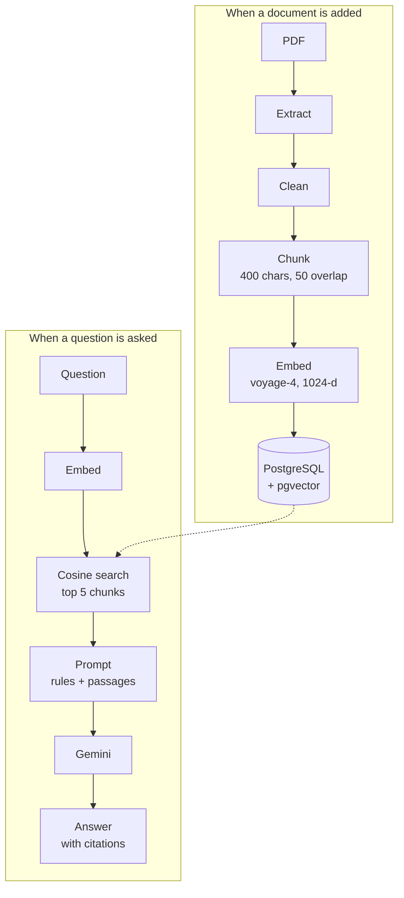

<p align="center">
  
</p>

<h1 align="center">LingoHub</h1>

<p align="center">
  Learn the English people actually use in Australia and New Zealand,<br>
  with a hand-built RAG pipeline that answers from your own learning materials.
</p>

<p align="center">
  
  
  
  
  
</p>

---

## Overview

LingoHub is a vocabulary app built on a 3,000-entry workplace-English book (108-page PDF). Learners browse and save words, and ask questions in English or Chinese. Every answer comes from the source material, with numbered citations.

The RAG pipeline is written from scratch, without LangChain. It covers PDF ingestion, cleaning, chunking, embedding, vector search and grounded generation. Chunking settings were chosen with a retrieval evaluation, not by guesswork.

| | |
|---|---|
| **Top-5 retrieval accuracy** | **95%**, up from 75% after tuning chunk size and overlap |
| **Context sent to the LLM** | Halved, from ~3,900 to ~1,900 characters per question |
| **Knowledge base** | 3,000 entries → 600 chunks → 1024-dimensional vectors |

## Features

- **Ask with citations.** Answers cite the passages they use, like `[1]`, and list their sources.
- **Honest fallback.** If the materials don't cover a question, LingoHub says so. It only answers from general AI knowledge after the learner agrees.
- **Browse and shuffle** all 3,000 words, with Chinese meanings and example sentences.
- **Favorites** saved in the browser.
- **Light and dark** themes.

## How it works



| Step | What it does | Code |
|---|---|---|
| Extract | Reads text page by page, keeping line breaks | `PdfTextExtractor.cs` |
| Clean | Removes repeated headers and page numbers, normalises look-alike characters | `TextCleaner.cs` |
| Chunk | Splits at paragraph → line → sentence → word boundaries, with overlap | `TextChunker.cs` |
| Embed | Batches of 128, retries on rate limits, only fills missing vectors | `EmbeddingService.cs` |
| Retrieve | `ORDER BY embedding <=> query LIMIT 5`, same embedding model only | `RetrievalService.cs` |
| Generate | Grounded prompt, required citations, fixed "not found" answer | `RagService.cs`, `LlmService.cs` |

## Retrieval evaluation

`LingoHub.Eval` scores retrieval on 20 labelled questions of four types: English, Chinese, Chinese-to-English lookup and scenario-based. A hit means one retrieved chunk contains both the right word and its example sentence. The harness reuses the production ingestion code, and its `live` mode confirms the running API gives the same scores.

| Chunk size : overlap | Hit@1 | Hit@5 | MRR | Entries split across chunks |
|---|---|---|---|---|
| 200 : 0 | 65% | 70% | 0.67 | 548 |
| 400 : 0 | 65% | 75% | 0.69 | 281 |
| **400 : 50 (current)** | **75%** | **95%** | **0.81** | **0** |
| 400 : 150 | 70% | 85% | 0.76 | 0 |
| 800 : 150 (original) | 40% | 75% | 0.55 | 0 |
| 3000 : 300 | 65% | 85% | 0.72 | 0 |

Each entry is only about 70 characters long. Large chunks mix many words into one vector, which weakens the match. Without overlap, entries get cut in half. With 20 questions, each question is worth 5%, so read these as trends rather than exact figures.

## Tech stack

| Layer | Technology |
|---|---|
| Back end | ASP.NET Core (.NET 10), EF Core |
| Database | PostgreSQL 17 + pgvector (Docker) |
| PDF | PdfPig |
| Embeddings | Voyage AI `voyage-4` (1024 dimensions) |
| LLM | Google Gemini |
| Front end | Next.js 16, React 19, Tailwind CSS 4 |
| Testing | xUnit, custom retrieval evaluation |

## Project structure

```
LingoHub/
├── LingoHub.Api/                 ASP.NET Core API: the RAG pipeline
│   ├── Controllers/              HTTP endpoints: documents, retrieval, ask
│   ├── Services/                 Extract → clean → chunk → embed → retrieve → generate
│   ├── Data/                     EF Core context and entities (Document, Chunk)
│   ├── Migrations/               Database schema, including the vector(1024) column
│   └── appsettings.json          Chunking, embedding, retrieval and LLM settings
├── LingoHub.Eval/                Retrieval evaluation harness and questions.json
├── LingoHub.Test/                Unit tests for text cleaning and chunking
├── lingohub-web/                 Next.js front end
│   ├── app/                      Pages: home, favorites, about, contact
│   ├── components/               UI components
│   └── lib/                      API client, vocabulary data, favorites store
├── docker-compose.yml            PostgreSQL + pgvector
├── Kiwi_IT_Workplace_English_3000_v2.pdf    Source document
└── kiwi_it_words_v2.json         The same 3,000 entries as JSON (used by the evaluation)
```

## Getting started

**Prerequisites:** .NET 10 SDK, Node.js 20+, Docker Desktop, the EF Core CLI (`dotnet tool install --global dotnet-ef`), and API keys for [Voyage AI](https://www.voyageai.com/) and [Gemini](https://aistudio.google.com/).

```bash
# 1. Start the database
docker compose up -d

# 2. Store API keys outside the repo
cd LingoHub.Api
dotnet user-secrets set "Embedding:ApiKey" "<your Voyage key>"
dotnet user-secrets set "Llm:ApiKey" "<your Gemini key>"

# 3. Create the tables and start the API        → http://localhost:5021
dotnet ef database update
dotnet run --launch-profile http

# 4. Start the front end in a new terminal       → http://localhost:3000
cd lingohub-web
npm install
npm run dev
```

Load the source document from the repository root. This extracts, chunks and embeds it:

```bash
curl -F "file=@Kiwi_IT_Workplace_English_3000_v2.pdf" http://localhost:5021/api/documents
```

> If the API runs on a different address, set `NEXT_PUBLIC_API_URL` for the front end.

## API

| Method | Endpoint | Purpose |
|---|---|---|
| `GET` | `/api/health` | API and database status |
| `GET` | `/api/documents` | List documents with chunk counts |
| `POST` | `/api/documents` | Upload a PDF and run the ingestion pipeline |
| `GET` | `/api/documents/{id}/chunks` | Inspect a document's chunks |
| `POST` | `/api/documents/{id}/embeddings` | Embed any chunks that are still missing vectors |
| `POST` | `/api/retrieval` | Top-k similar chunks for a query |
| `POST` | `/api/ask` | Full RAG answer with sources |

More request examples are in [`LingoHub.Api/LingoHub.Api.http`](LingoHub.Api/LingoHub.Api.http).

## Testing

```bash
dotnet test                                     # unit tests
dotnet run --project LingoHub.Eval -- compare   # compare chunking configurations
dotnet run --project LingoHub.Eval -- live      # score the running API
```

## Roadmap

- Hybrid search (full-text + vector) for acronyms and short slang that embeddings miss
- A similarity threshold that skips the LLM call when no passage is relevant
- A generation evaluation covering faithfulness, citation accuracy and refusals
- An HNSW index and a background ingestion queue for larger document sets
